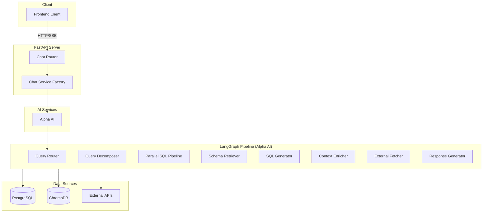
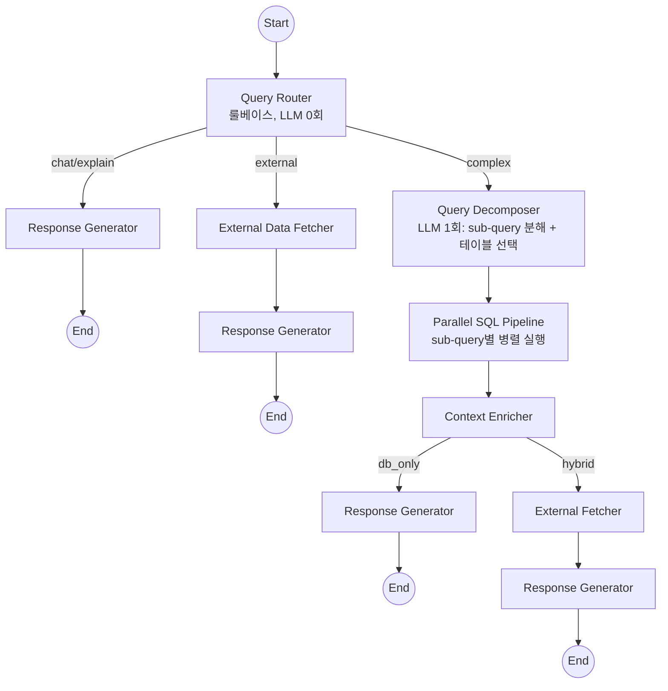
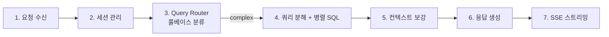

# 주식 AI 비서


시나리오 기반 주식 투자 전략 서비스의 RAG 기반 주식 AI 비서 백엔드 API입니다.

---

## 목차

- [이 저장소의 역할](#이-저장소의-역할)
- [프로젝트 구조](#프로젝트-구조)
- [시스템 아키텍쳐](#시스템-아키텍쳐)
- [AI 비서 기술](#ai-비서-기술)
- [주요 기능 설명](#주요-기능-설명)
- [History](#history)
- [API 엔드포인트](#api-엔드포인트)
- [개발환경 및 사용기술](#개발환경-및-사용기술)
- [내부 디렉토리 구조](#내부-디렉토리-구조)
- [License](#license)

---

## 이 저장소의 역할

전체 프로젝트 중 **AI 비서 (Chat API)** 컴포넌트를 담당합니다.

- RAG 기반 주식 투자 전략 전문 LLM 서비스
- Text-to-SQL 변환을 통한 데이터베이스 조회
- 실시간 SSE 스트리밍 응답

## 프로젝트 구조

| 저장소 | 설명 | 기술 스택 |
|--------|------|-----------|
| [**api**](https://github.com/vinjung/alphafolio_api) | AI 채팅 백엔드 API | FastAPI, LangGraph, ChromaDB, Fine-tuned GPT |
| [**data**](https://github.com/vinjung/alphafolio_data) | 데이터 자동 수집 & 지표 계산 | FastAPI, asyncpg, Cloud Scheduler |
| [**chat**](https://github.com/vinjung/alphafolio_chat) |  **📍AI 비서 개발환경(현재 저장소)** | LangChain, LangGraph, ChromaDB |
| [**quant**](https://github.com/vinjung/alphafolio_quant) | 멀티팩터 퀀트 분석 엔진 | NumPy, SciPy, hmmlearn |
| [**stock_agent**](https://github.com/vinjung/alphafolio_stock_agent) | 종목 투자 전략 Multi-Agent AI | LangGraph, Task-driven Architecture |
| [**portfolio**](https://github.com/vinjung/alphafolio_portfolio) | 포트폴리오 생성 & 리밸런싱 엔진 | Risk Parity, VaR/CVaR, LangGraph |

> **Note:** alpha/chat의 chat 모델(alpha_ai_model)은 alpha_front/api로 동기화됩니다.

---

## 시스템 아키텍쳐

### 전체 시스템 구성



### Alpha AI 워크플로우 (Hybrid Query Router)



### 데이터 흐름



---

## AI 비서 기술

<details>
<summary><b>동시성 제어 & 배포 아키텍쳐</b></summary>

**Multi-Worker 배포**
- uvicorn `--workers 3`으로 멀티 프로세스 운영
- 각 워커가 독립적인 DB 풀, 요청 큐, LLM 리미터 보유
- 워커 간 상태 공유 없음 (프로세스 격리)

**asyncpg 커넥션 풀링**
- 워커당 최대 5개 커넥션 (총 15개 = 5 * 3 workers)
- 커맨드 타임아웃 60초로 장시간 쿼리 보호
- `POSTGRES_POOL_MAX` 설정값을 워커 수로 자동 분할

**요청 큐 (RequestQueueManager)**
- asyncio Semaphore 기반 동시성 제한
- 워커당 최대 5개 동시 처리 (`MAX_CONCURRENT_REQUESTS`)
- 대기열 최대 20개 (`MAX_WAITING_REQUESTS`), 초과 시 503 반환

**Rate Limiting (slowapi)**
- SSE 스트리밍: 10회/분 (`RATE_LIMIT_STREAM`)
- 일반 채팅: 30회/분 (`RATE_LIMIT_CHAT`)
- IP 기반 제한, 초과 시 429 반환

**LLM 동시성 제한 (LLMConcurrencyLimiter)**
- 프로바이더별 독립 Semaphore
- Anthropic: 최대 8개 동시 호출
- OpenAI: 최대 10개 동시 호출
- API Rate Limit 보호

</details>

<details>
<summary><b>다층 RAG 시스템</b></summary>

**벡터 데이터베이스**
- ChromaDB 영구 저장소 (코사인 유사도)
- OpenAI text-embedding-3-small 임베딩 모델
- 배치 처리로 API 호출 최소화

**RAG 파이프라인 (Query Decomposition 모드)**

| 단계 | 컴포넌트 | 역할 |
|------|----------|------|
| 1 | Query Decomposer | LLM이 57개 테이블 카탈로그에서 직접 테이블 선택 + sub-query 분해 (Schema RAG 대체) |
| 2 | Few-Shot RAG | sub-query별 유사 질문-SQL 예시 검색 (211개 예제) |
| 3 | Term Mapper | 금융 용어 -> DB 컬럼 매핑 (198개 컬럼 + 64개 로직 = 262개) |

**하이브리드 검색 (RRF)**
- 벡터 검색 70% + 키워드 검색 30% 가중치
- Reciprocal Rank Fusion 알고리즘으로 결과 통합

**시장 시간 인식**
- 한국 시장 개장 여부 자동 감지 (09:30-16:00 KST)
- 장중: 실시간 데이터 테이블 (kr_intraday)
- 장마감: 종가 데이터 테이블 (kr_intraday_total)

</details>

<details>
<summary><b>Text-to-SQL 파이프라인</b></summary>

**SQL 생성**
- 스키마 컨텍스트 + Few-shot 예시 + 용어 매핑 통합
- 의도별 최적화된 프롬프트 템플릿
- 폴백: LLM 실패 시 의도별 기본 SQL 템플릿

**SQL 검증 (다층 보안)**

| 검증 단계 | 내용 |
|-----------|------|
| 1. 보안 검사 | DROP, DELETE, UPDATE 등 차단 키워드 탐지 |
| 2. 명령문 검사 | SELECT/WITH 문만 허용 |
| 3. 테이블 검사 | 화이트리스트 테이블만 허용 |
| 4. 문법 검사 | EXPLAIN으로 PostgreSQL 문법 검증 |

**자동 수정 (최대 2회 재시도)**
1. 패턴 기반 공통 오류 자동 수정
2. LLM 기반 SQL 재생성

**Fine-tuned SQL 모델**

범용 LLM(Claude)의 Text-to-SQL 성능을 강화하기 위해 도메인 특화 Fine-tuning을 적용했습니다.

**적용 배경**
- 범용 LLM은 금융 도메인 테이블 구조(54개 테이블, 1000+ 컬럼)에 대한 사전 지식이 부족
- Few-shot 프롬프트만으로는 복잡한 SQL 패턴(UNION ALL, 윈도우 함수, 시장별 분기)의 일관성 확보 어려움
- 프롬프트 토큰 비용 절감: Fine-tuned 모델은 규칙이 내재화되어 간소화된 프롬프트 사용 가능

**Dual-Model 전략 (Fine-tuned + Claude Fallback)**

sub-query별 Fine-tuned 모델을 우선 사용하되, 실패 시 Claude로 자동 전환합니다.

```
사용자 질문 -> Query Decomposer (sub-query 분해)
                 |
                 [sub-query 1] -> Fine-tuned (1차) -> 실패 시 Claude (2차)
                 [sub-query 2] -> Fine-tuned (1차) -> 실패 시 Claude (2차)  (병렬 실행)
                 [sub-query 3] -> Fine-tuned (1차) -> 실패 시 Claude (2차)
                 |
                 결과 병합 -> Context Enricher -> Response Generator
```

- Fine-tuned 모델: 빠른 응답, 낮은 비용, 학습된 패턴에 최적화
- Claude Fallback: 미학습 패턴 대응, 복잡한 추론 필요 시 활용
- sub-query별 독립 retry (최대 1회 패턴 기반 수정)
- `sql_model_used` 필드로 어떤 모델이 SQL을 생성했는지 추적 가능

**복잡도 기반 모델 라우팅**

쿼리에 필요한 테이블 수에 따라 모델을 자동 선택합니다.

| 조건 | 사용 모델 | 이유 |
|------|----------|------|
| 테이블 5개 이하 | Fine-tuned (GPT-4.1-mini FT) | 학습 데이터에 포함된 단순 패턴 |
| 테이블 6개 이상 | Claude (Sonnet 4.6) | 복잡한 JOIN/서브쿼리 추론 필요 |
| Retry (1차 실패 후) | Claude (Sonnet 4.6) | 안전한 Fallback |

- 설정: `FINE_TUNED_MAX_TABLES=5` (config.py)
- 라우팅 로그: `"Complexity routing: X tables > threshold 5, using Claude directly"`

**학습 데이터 구성**

| 구분 | 수량 | 설명 |
|------|------|------|
| Few-shot 예제 | 211개 | 수동 작성 (의도별 SQL 패턴) |
| Synthetic 데이터 | 484개 | 기존 예제 기반 자동 변형 |
| **총 학습 데이터** | **695개** | 557 train / 70 val / 68 test |

**학습 데이터 카테고리**

| 카테고리 | 예시 질문 | SQL 패턴 |
|----------|----------|----------|
| 종목 조회 (query) | "삼성전자 현재가" | 단일 테이블 SELECT |
| 랭킹 (ranking) | "시총 상위 10개" | ORDER BY + LIMIT |
| 필터링 (filter) | "PER 10 이하 종목" | WHERE 조건 |
| 기술적 분석 (technical) | "RSI 30 이하 과매도" | 기술지표 테이블 JOIN |
| 비교 (comparison) | "삼성 vs SK하이닉스" | 다중 종목 비교 |
| 업종/테마 (sector) | "반도체 관련주" | theme/industry 필터 |
| BOTH 마켓 | "한미 반도체 비교" | UNION ALL (KR + US) |

**Fine-tuning 설정**

| 항목 | 값 |
|------|------|
| Base Model | gpt-4.1-mini-2025-04-14 |
| Suffix | (프로젝트별 설정) |
| Epochs | 3 |
| 학습 시간 | ~35분 |

**설정**

| 설정 키 | 설명 | 기본값 |
|---------|------|--------|
| `FINE_TUNED_SQL_ENABLED` | Fine-tuned 모델 활성화 여부 | `False` |
| `FINE_TUNED_SQL_MODEL` | 모델 ID | `ft:<base_model>:<org>:<suffix>:<id>` |

**Fine-tuning 파이프라인 실행**

```bash
# 1. 학습 데이터 생성 (few_shot_examples.py -> JSONL)
python -m fine_tuning.prepare_training_data

# 2. Train/Validation/Test 분할
python -m fine_tuning.split_data

# 3. OpenAI에 업로드 & 학습 시작
python -m fine_tuning.upload_and_train

# 4. 학습 완료 후 .env 업데이트
# FINE_TUNED_SQL_MODEL=ft:<base_model>:<org>:<suffix>:<new_hash>

# 5. 프론트엔드 동기화
bash scripts/sync_to_front.sh
```

**재학습이 필요한 경우**
- `few_shot_examples.py` SQL 예시 추가/수정 시
- `sql_prompt.py` 스키마 설명 변경 시
- `term_mapper.py` 용어 매핑 변경 시

</details>

<details>
<summary><b>SQL 보안</b></summary>

**화이트리스트 기반 접근 제어**
- 한국 시장: 23개 허용 테이블 (kr_*, market_index 등)
- 미국 시장: 37개 허용 테이블 (us_*, market_index 등)
- 허용되지 않은 테이블 접근 시 즉시 거부

**차단 키워드**
```
DROP, DELETE, UPDATE, INSERT, ALTER, TRUNCATE,
CREATE, GRANT, REVOKE, EXEC, EXECUTE
```

**SQL Injection 방지**
- asyncpg 파라미터화 쿼리로 자동 이스케이프
- 다층 검증으로 악의적 쿼리 원천 차단

</details>

<details>
<summary><b>스마트 캐싱</b></summary>

**시장별/시간대별 차등 TTL**

| 시장 | 상태 | TTL |
|------|------|-----|
| 한국 | 장중 (09:30-16:00) | 30분 |
| 한국 | 장마감 후 | 익일 09:30까지 |
| 미국 | 일일 업데이트 후 | 24시간 |
| 공통 | 일반 데이터 | 5분 |

**캐시 최적화**
- 시장 개장 여부 자동 감지
- 불필요한 DB 쿼리 최소화
- 캐시 히트율 모니터링

</details>

<details>
<summary><b>Graceful Degradation</b></summary>

**외부 API 장애 대응**
- 3회 재시도 + 지수 백오프
- Rate Limit (429) 시 Retry-After 헤더 준수
- API 실패 시 대체 데이터 소스로 자동 전환

**에러 코드 체계**

| 코드 | 상황 | 대응 |
|------|------|------|
| API_NOT_CONFIGURED | API 키 미설정 | 해당 API 스킵 |
| RATE_LIMITED | 요청 한도 초과 | 대기 후 재시도 |
| TIMEOUT | 응답 타임아웃 | 다른 API로 전환 |
| NETWORK_ERROR | 네트워크 오류 | 캐시 데이터 사용 |

</details>

<details>
<summary><b>설명 가능한 AI (Explainable AI)</b></summary>

**응답에 포함되는 메타정보**

| 정보 | 내용 |
|------|------|
| Data Sources | 사용된 테이블, 검색 행 수, 외부 데이터 수 |
| Reasoning Hints | 의도별 분석 초점, 지표 해석 방향 |
| Confidence Level | 데이터 충분성 기반 신뢰도 (HIGH/MEDIUM/LOW) |

**신뢰도 점수 계산**
- DB 데이터 존재: +30점
- 충분한 샘플 (10개 이상): +10점
- 뉴스 데이터: +15점
- 공시 정보: +10점
- 유사 쿼리 예시 발견: +10점

</details>

<details>
<summary><b>실시간 스트리밍 & 용어 매핑</b></summary>

**세션 제한**

| 설정 | 값 | 설명 |
|------|------|------|
| `MAX_MESSAGES_PER_SESSION` | 50 | 세션당 최대 메시지 수 |
| `MAX_TOKENS_PER_SESSION` | 100,000 | 세션당 최대 토큰 수 |

**Redis 4-DB 구조**

| DB Index | 용도 | 설명 |
|----------|------|------|
| 0 | Cache | 시장별 데이터 캐싱 |
| 1 | Task | Celery 워커 태스크 (미사용) |
| 2 | Stream | 스트리밍 상태 |
| 3 | Task Result | 태스크 결과 저장 |

**시작 시 캐시 클리어**
- 서비스 재시작/배포 시 `stock_cache:*` 키를 자동 삭제하여 오래된 캐시 방지

**SSE (Server-Sent Events)**
- 청크 크기: 8자 단위 점진적 전송 (시뮬레이션 스트리밍), LLM 토큰 스트리밍은 실시간
- 전체 응답 완성 대기 없이 즉시 표시
- 중간 상태 (processing, sql, chunk, complete) 전송

**세션 통합 스트리밍**
1. 세션 ID 전송 -> 2. 사용자 메시지 저장 -> 3. 청크 스트리밍 -> 4. AI 응답 저장

**용어 매핑 시스템**

| 카테고리 | 예시 |
|----------|------|
| 가격/거래 | 현재가, 종가, 시총, 거래량 -> close, market_cap, volume |
| 기술지표 | RSI, MACD, 볼린저밴드, 이평선 -> rsi, macd, real_upper_band |
| 투자자 | 외국인, 기관, 개인 -> foreign_net, inst_net |
| 퀀트 | 종합등급, 가치등급 -> final_grade, value_grade |
| 환율 | 원달러, 원엔, 환율 -> data_value (exchange_rate) |
| 경제지표 | 기준금리, 한국은행, 인플레이션 -> data_value (bok_economic_indicators) |
| 프로그램매매 | 차익거래, 비차익거래 -> net_buy_value (kr_program_daily_trading) |

**비즈니스 로직 매핑**
- 과매수: RSI > 70
- 과매도: RSI < 30
- 골든크로스: MA5 > MA20
- 정배열: 종가 > MA5 > MA20 > MA60
- 프로그램 순매수: net_buy_value > 0
- 프로그램 순매도: net_buy_value < 0

</details>

<details>
<summary><b>RAG 시스템 관리</b></summary>

**데이터베이스 스키마 구성**

| 시장 | 테이블 수 | 주요 테이블 |
|------|----------|-------------|
| 한국 (KR) | 20개 | kr_intraday, kr_stock_grade, kr_indicators, kr_dividends 등 |
| 미국 (US) | 34개 | us_daily, us_stock_grade, us_income_statement, us_options 등 |
| 공통 | 3개 | market_index, bok_economic_indicators, exchange_rate |

**RAG 재인덱싱**

스키마나 Few-shot 예시 수정 후 ChromaDB 벡터 인덱스를 재구축해야 합니다.

```bash
# 로컬 환경
python scripts/reindex_rag.py

# Railway 배포 환경
railway run python scripts/reindex_rag.py
```

**재인덱싱이 필요한 경우**
- `sql_prompt.py` 스키마 수정 시
- `few_shot_examples.py` SQL 예시 추가/수정 시
- `term_mapper.py` 용어 매핑 수정 시

**참고:** 첫 배포 시에는 자동으로 인덱싱됩니다. 기존 인덱스가 있는 환경에서 스키마 변경 후에만 재인덱싱 스크립트 실행이 필요합니다.

</details>

<details>
<summary><b>BOTH 마켓 기능 (KR + US 통합 검색)</b></summary>

**자동 마켓 판별**

사용자 질문에서 마켓 특정 키워드를 감지하여 자동으로 마켓을 판별합니다.

| 조건 | 마켓 | 예시 키워드 |
|------|------|-------------|
| 양국 키워드 | BOTH | 한미, 미한, 양국, 한국 미국 |
| US + KR 키워드 동시 | BOTH | 삼성전자와 테슬라 비교 |
| US 전용 키워드 | US | VIX, 옵션, 풋콜비율, 내부자 거래, 연방기금금리 |
| KR 전용 키워드 | KR | 외국인, 기관, 프로그램 매매, 대량매매, 목표주가 |
| 키워드 없음 (기본값) | KR | 좋은 주식 추천해줘, RSI 30 이하 종목 |

**BOTH 마켓 동작 방식**

Query Decomposition 모드 (기본):
- sub-query별 독립 마켓(KR/US) 할당으로 BOTH 문제 구조적 해소
- BOTH 감지 시 dominant market resolution: KR/US sub-query 수 비교 후 다수 마켓 선택
- 각 sub-query가 자체 마켓 기준으로 SQL 생성/실행

Standard Pipeline 폴백 시:
- UNION ALL 쿼리로 결과 통합 (legacy 방식)
- 결과 절반씩 분배 (예: 10개 요청 시 KR 5개 + US 5개)

**예시 질문과 결과**

| 질문 | 마켓 판별 | 결과 |
|------|----------|------|
| "좋은 주식 추천해줘" | KR | KR 10개 (기본값) |
| "한미 주식 비교해줘" | BOTH | KR 5개 + US 5개 (양국 키워드) |
| "삼성전자와 테슬라 비교" | BOTH | KR 5개 + US 5개 (양쪽 키워드 동시) |
| "외국인 순매수 상위" | KR | KR 10개 (US에 외국인 데이터 없음) |
| "VIX 20 이하일 때 상승 종목" | US | US 10개 (KR에 VIX 데이터 없음) |

</details>

---

## 주요 기능 설명

### AI 서비스

| 서비스 | 설명 | 특징 |
|--------|------|------|
| ALPHA_AI | 알파 AI (금융 전문) | 자연어 -> SQL 변환, 데이터 조회, 주가 분석, 투자 전략, 세션 히스토리 |

### Alpha AI 워크플로우

LangGraph 기반 Hybrid Query Router 파이프라인 (`USE_QUERY_DECOMPOSITION=true`):

1. **Query Router**: 룰베이스 라우터 (LLM 0회). 키워드 분석으로 쿼리를 chat/external/complex 3가지 경로로 분류
2. **Complex Path**: Query Decomposer (LLM 1회, sub-query 분해 + 테이블 선택) -> Parallel SQL Pipeline (sub-query별 병렬 실행). ~10-20초 소요
4. **Context Enricher**: 업종 비교, 지표 추세, 투자자 동향, 시세 맥락, 시장 개요 등 보충 데이터 자동 조회 (병렬 비동기, 5초 타임아웃)
5. **External Data Fetcher**: 외부 API 데이터 수집 (hybrid/external_only 모드)
6. **Hybrid Analyzer**: DB + 외부 API 결과 통합 분석
7. **Response Generator**: primary result + sub_query_results를 통합하여 최종 응답 생성

> Feature flag `USE_QUERY_DECOMPOSITION=false`로 설정하면 기존 직렬 파이프라인으로 폴백됩니다.

---

## History

<details>
<summary><b>v1: 직렬 파이프라인 아키텍처 (~ 2026-02-14)</b></summary>

### 구조

```
START -> Intent Classifier -> Entity Extractor -> Data Source Router
  -> Schema Retriever (키워드 RAG) -> SQL Generator -> SQL Validator
  -> SQL Executor -> Context Enricher -> Response Generator -> END
```

- 5-8회 순차 LLM 호출 (intent -> entity -> SQL gen -> validation retry -> response)
- Schema Retriever: 11개 도메인 x 120+ 키워드 블록으로 테이블/컬럼 검색
- SQL 1개로 전체 질문 처리 (UNION ALL로 KR+US 통합)
- 검증 실패 시 최대 2회 retry (패턴 수정 -> LLM 재생성)

### 특징

- **Unified Classifier** (선택적): Intent + Entity를 단일 LLM 호출로 통합 (`USE_UNIFIED_CLASSIFIER=true`)
- **Fine-tuned SQL 모델**: GPT-4.1-mini 기반 695개 학습 데이터, 실패 시 Claude Fallback
- **3단계 RAG**: Schema RAG (키워드 매칭) -> Few-Shot RAG (벡터 검색) -> Term Mapper (용어 매핑)

### 한계점

| 항목 | 문제 |
|------|------|
| 키워드 매칭 취약 | 120+ 키워드 기반 테이블 검색 -> 띄어쓰기, 동의어, 신규 용어 미스 빈발 |
| 단일 SQL 한계 | 복잡 쿼리(KR 종목 + US 매크로 + 재무 + 기술)를 SQL 1개로 처리 불가 |
| 순차 실행 병목 | 5-8회 순차 LLM 호출, retry 포함 25-70초 소요 |
| BOTH 마켓 볼트온 | UNION ALL 기반 KR+US 통합이 edge case 지속 발생 |
| SQL 1회 통과율 ~60% | 복잡 SQL에서 retry 빈발 -> 응답 시간 증가 |

### 개선 방향 (-> v2)

- LLM이 57개 테이블 카탈로그에서 직접 테이블 선택 (키워드 매칭 제거)
- 질문을 sub-query로 분해 -> 단순 SQL 여러 개 병렬 실행
- 3 sequential LLM steps로 단축 (분해 -> 병렬SQL -> 응답)
- sub-query별 market 분리 (KR/US BOTH 문제 구조적 해소)
- SQL 1회 통과율 ~90%+ (단순 SQL이므로 패턴 수정만으로 충분)

</details>

<details>
<summary><b>v2: Query Decomposition 아키텍처 (2026-02-14 ~ 2026-02-16)</b></summary>

### 구조

```
START -> Query Decomposer (LLM 1회: intent + entity + sub-query + 테이블 선택)
  -> Parallel SQL Pipeline (sub-query별 병렬 실행)
  -> Context Enricher -> Response Generator -> END
```

### v1 대비 개선

| 항목 | v1 | v2 |
|------|----|----|
| 테이블 선택 | 키워드 RAG (120+ 키워드 블록) | LLM이 57개 카탈로그에서 직접 선택 |
| SQL 구조 | 단일 SQL (복잡) | sub-query 분해 (단순 SQL 여러 개) |
| 실행 방식 | 5-8회 순차 LLM 호출 | 3 sequential step (분해 -> 병렬SQL -> 응답) |
| BOTH 마켓 | UNION ALL (edge case 빈발) | sub-query별 마켓 분리 |
| SQL 1회 통과율 | ~60% | ~90%+ |
| 응답 시간 | 25-70초 | 10-20초 |

### 한계점

| 항목 | 문제 |
|------|------|
| 단순 쿼리 과잉 처리 | "삼성전자 현재가"도 Claude 2회 호출, ~8초 소요 |
| Fine-tuned 모델 미활용 | QD 아키텍처 활성화로 Standard Pipeline의 FT 모델 비활성 |
| LLM 비용 | 단순 쿼리에도 Claude 호출 필수 (Query Decomposer) |

</details>

<details>
<summary><b>v3: Hybrid Query Router 아키텍처 (2026-02-16 ~)</b></summary>

### 구조

```
START -> Query Router (룰베이스, LLM 0회)
  ├─ "chat/explain" -> Response Generator -> END
  ├─ "external" -> External Data Fetcher -> Response Generator -> END
  └─ "complex" -> Query Decomposer -> Parallel SQL Pipeline
                  -> Context Enricher -> [hybrid?] -> Response Generator -> END
```

> **참고**: api 저장소에서는 v3 Hybrid Router로 simple path가 추가되었으나, chat 개발환경에서는 3-way routing (chat/external/complex)만 구현되어 있습니다.

### v2 대비 개선

| 항목 | v2 (QD only) | v3 (chat repo) |
|------|-------------|----------------|
| 다중조건 스크리닝 | Claude 3-4회, ~16초 | 동일 (QD 경로) |
| 한미 비교 분석 | Claude 3회, ~15초 | 동일 (QD 경로) |

### 라우팅 기준

- **complex**: DB 쿼리가 필요한 모든 요청 (기본 경로)
- **chat/explain**: 인사, 금융 용어 설명 ("PER가 뭐야?")
- **external**: 순수 뉴스/공시 요청 (DB 키워드 없음)

</details>

---

## API 엔드포인트

### 루트 엔드포인트

| Method | Endpoint | 설명 |
|--------|----------|------|
| GET | `/` | 루트 (API 상태 확인) |
| GET | `/health` | 전체 헬스 체크 (환경, 포트, Railway 상태) |
| GET | `/test` | 테스트 엔드포인트 |
| GET | `/ping` | Ping 체크 |
| POST | `/echo` | 에코 테스트 |

### 채팅 API (`/chat`)

| Method | Endpoint | 설명 |
|--------|----------|------|
| POST | `/chat/` | 기본 채팅 (동기) |
| POST | `/chat/stream` | SSE 스트리밍 (실시간 응답) |
| GET | `/chat/health` | 채팅 API 헬스 체크 |

### 세션 관리 API (`/chat/history`)

| Method | Endpoint | 설명 |
|--------|----------|------|
| POST | `/chat/history/sessions` | 새 세션 생성 |
| GET | `/chat/history/sessions` | 세션 목록 조회 |
| GET | `/chat/history/sessions/{id}` | 세션 상세 조회 |
| GET | `/chat/history/sessions/{id}/messages` | 메시지 목록 조회 |
| GET | `/chat/history/sessions/{id}/limit` | 세션 메시지/토큰 제한 상태 조회 |
| GET | `/chat/history/sessions/{id}/full` | 세션 상세 + 제한 정보 통합 조회 |
| PATCH | `/chat/history/sessions/{id}/title` | 세션 제목 수정 |
| POST | `/chat/history/sessions/{id}/pin` | 세션 고정/해제 |
| POST | `/chat/history/sessions/{id}/archive` | 세션 아카이브 |
| DELETE | `/chat/history/sessions/{id}` | 세션 삭제 |

### 통계 API (`/chat/history`)

| Method | Endpoint | 설명 |
|--------|----------|------|
| GET | `/chat/history/users/{user_id}/stats` | 사용자 통계 (세션 수, 메시지 수, 토큰, 활동일) |

### 통합 채팅 API

| Method | Endpoint | 설명 |
|--------|----------|------|
| POST | `/chat/stream-with-history` | 세션 통합 SSE 스트리밍 (자동 메시지 저장) |
| POST | `/chat/continue/{session_id}` | 기존 대화 재개 |
| GET | `/chat/integrated/health` | 통합 채팅 시스템 헬스 체크 |

### 헬스 체크 API

| Method | Endpoint | 설명 |
|--------|----------|------|
| GET | `/health` | 전체 시스템 상태 |
| GET | `/chat/health` | 채팅 API 상태 |
| GET | `/chat/history/health` | 대화 히스토리 시스템 상태 (DB 연결 확인) |
| GET | `/chat/integrated/health` | 통합 채팅 시스템 상태 |

---

## 개발환경 및 사용기술

| 구분 | 기술 |
|------|------|
| Language | Python 3.12 |
| Framework | FastAPI |
| LLM Framework | LangChain, LangGraph |
| Database | PostgreSQL |
| Vector Store | ChromaDB |
| Cache | Redis |
| Deploy | Railway |
| Async Driver | asyncpg |

### LLM Providers

| Provider | 기본 모델 | 패키지 | 비고 |
|----------|----------|--------|------|
| OpenAI | GPT-4o | langchain-openai | Claude 장애 시 GPT-4.1 폴백 (SQL 생성, 응답 생성) |
| Anthropic | Claude Sonnet 4.6 | langchain-anthropic | max_tokens 기본값 4000 |
| Google | Gemini | langchain-google-genai | |
| Perplexity | Sonar Large (llama-3.1-sonar-large-128k-online) | langchain-perplexity | 웹 검색 특화 |
| Grok | Grok 4 | langchain-xai | 실험적 |

### 외부 API

| API | 용도 | 설정 키 |
|-----|------|---------|
| Serper | 웹 검색 | `SERPER_API_KEY` |
| Naver | 뉴스/블로그 검색 | `NAVER_CLIENT_ID`, `NAVER_CLIENT_SECRET` |
| DART | 전자공시시스템 | `DART_API_KEY` |
| Google CSE | 커스텀 검색 엔진 | `GOOGLE_CSE_ID`, `GOOGLE_CSE_API_KEY` |
| KRX | 한국거래소 주식 데이터 | `KRX_API_KEY` |
| FMP | 글로벌 주식 데이터 | `FMP_API_KEY` |
| Marketstack | 글로벌 주식 데이터 | `MARKETSTACK_API_KEY` |

<details>
<summary><b>사용 라이브러리 상세</b></summary>

### Core
- fastapi >= 0.115.12
- uvicorn[standard] >= 0.34.2
- pydantic >= 2.11.5
- pydantic-settings >= 2.9.1
- python-dotenv >= 1.1.0

### LLM & AI
- langchain >= 0.3.26
- langchain-core >= 0.3.68
- langchain-openai >= 0.3.27
- langchain-anthropic >= 0.3.17
- langchain-google-genai >= 2.1.5
- langchain-perplexity >= 0.1.1
- langchain-community >= 0.3.27
- langchain-google-community >= 2.0.7
- langchain-text-splitters >= 0.3.8
- openai >= 1.93.1

### LangGraph
- langgraph >= 0.5.1
- langgraph-checkpoint >= 2.1.0
- langgraph-prebuilt >= 0.5.2
- langgraph-sdk >= 0.1.72
- langsmith >= 0.3.45

### Database & Storage
- asyncpg >= 0.30.0
- chromadb >= 1.1.0
- redis >= 6.2.0

### Utilities
- slowapi >= 0.1.9
- google-search-results >= 2.4.2
- rapidfuzz >= 3.0.0

</details>

---

## 내부 디렉토리 구조

```
alpha/chat/
├── main.py                          # FastAPI 앱 엔트리포인트 (lifespan, CORS, 라우터 등록)
├── config.py                        # Pydantic Settings 기반 설정 관리
├── database.py                      # PostgreSQL 커넥션 풀 관리 (asyncpg)
├── models.py                        # Pydantic 요청/응답 모델
├── requirements.txt                 # Python 패키지 의존성
│
├── routers/                         # FastAPI 라우터 (API 엔드포인트)
│   ├── chat.py                      #   채팅 API (/chat/, /chat/stream, /chat/health)
│   ├── chat_history.py              #   세션 관리 API (/chat/history/sessions/*)
│   └── chat_integrated.py           #   통합 스트리밍 API (/chat/stream-with-history)
│
├── core/                            # 핵심 프레임워크
│   ├── rate_limiter.py              #   slowapi Rate Limiting 설정
│   └── llm/
│       ├── factory.py               #   LLM 팩토리 (get_llm, create_*_client)
│       ├── concurrency_limiter.py   #   LLM 프로바이더별 동시성 제한
│       └── types.py                 #   LLMProvider Enum (OPENAI, ANTHROPIC, GOOGLE, PERPLEXITY, GROK)
│
├── db/                              # 데이터베이스 클라이언트 초기화
│   ├── postgresql.py                #   PostgreSQL 풀 생성
│   ├── redis.py                     #   Redis 클라이언트 (cache, stream, task)
│   └── celery.py                    #   Celery 워커 설정 (미사용)
│
├── services/                        # 비즈니스 로직 계층
│   ├── queue_manager.py             #   요청 큐 & 동시성 제한 (asyncio Semaphore)
│   ├── cache_manager.py             #   캐시 관리
│   ├── chat_history_service.py      #   대화 메시지 영속성
│   │
│   └── chat/
│       ├── factory.py               #   Chat Service 팩토리 패턴
│       ├── base.py                  #   BaseChatService 추상 클래스
│       ├── types.py                 #   ChatServiceEnum (ALPHA_AI)
│       ├── session_manager.py       #   세션 CRUD
│       │
│       ├── alpha_ai_model/          #   Alpha AI (금융 전문 Text-to-SQL)
│       │   ├── chat_service.py      #     AlphaAIChatService
│       │   ├── graph/               #     LangGraph 워크플로우
│       │   │   ├── builder.py       #       그래프 빌드 & 라우팅
│       │   │   ├── types.py         #       AlphaAIGraphState
│       │   │   └── nodes/           #       처리 노드 (14개)
│       │   │       ├── query_router.py          # 룰베이스 라우터: simple/complex/chat/external 분류 (LLM 0회)
│       │   │       ├── query_decomposer.py      # Query Decomposition: intent + entity + sub-query 분해 + 테이블 선택
│       │   │       ├── parallel_sql_pipeline.py  # sub-query별 병렬 SQL gen/validate/execute
│       │   │       ├── unified_classifier.py  # 통합 분류기 (fallback용)
│       │   │       ├── intent_classifier.py   # (fallback용)
│       │   │       ├── entity_extractor.py    # (fallback용)
│       │   │       ├── data_source_router.py  # (fallback용)
│       │   │       ├── schema_retriever.py    # (fallback용)
│       │   │       ├── sql_generator.py       # (fallback용)
│       │   │       ├── sql_validator.py
│       │   │       ├── sql_executor.py
│       │   │       ├── context_enricher.py
│       │   │       ├── external_data_fetcher.py
│       │   │       ├── hybrid_analyzer.py
│       │   │       ├── visualization_resolver.py # 시각화 타입 결정 (차트/테이블)
│       │   │       └── response_generator.py
│       │   ├── rag/                 #     RAG 컴포넌트
│       │   │   ├── vector_store.py  #       ChromaDB 통합
│       │   │   ├── schema_rag.py    #       테이블/컬럼 스키마 검색
│       │   │   ├── few_shot_rag.py  #       유사 SQL 예시 검색
│       │   │   ├── term_mapper.py   #       금융 용어 -> DB 컬럼 매핑
│       │   │   ├── query_expander.py#       쿼리 확장
│       │   │   └── self_query.py    #       Self-querying RAG
│       │   ├── prompts/             #     LLM 프롬프트 템플릿
│       │   │   ├── sql_prompt.py    #       SQL 생성 프롬프트 + 스키마
│       │   │   ├── sql_prompt_finetuned.py # Fine-tuned 모델 전용 프롬프트
│       │   │   ├── few_shot_examples.py #   예시 쿼리-SQL 쌍 (211개)
│       │   │   ├── system_prompt.py #       시스템 프롬프트
│       │   │   └── analysis_prompts.py #    분석 프롬프트
│       │   ├── external_apis/       #     외부 데이터 소스
│       │   │   ├── base.py          #       BaseExternalAPI 추상 클래스
│       │   │   ├── serper_api.py    #       웹 검색 (Serper)
│       │   │   ├── naver_api.py     #       한국 뉴스/블로그 (Naver)
│       │   │   ├── dart_api.py      #       전자공시 (DART)
│       │   │   └── search_strategy.py #     멀티 API 검색 전략
│       │   ├── stock_resolver/      #     종목명 해석 & 퍼지 매칭
│       │   │   ├── resolver.py
│       │   │   ├── fuzzy_matcher.py
│       │   │   ├── korean_utils.py
│       │   │   ├── cache.py
│       │   │   └── types.py
│       │   └── tools/               #     LangChain 도구
│       │       ├── sql_tools.py
│       │       ├── search_tools.py
│       │       ├── chart_data_formatter.py
│       │       ├── supplementary_chart_builder.py  # 보조 차트 빌더
│       │       ├── financial_calculator.py
│       │       └── feedback_tools.py
│       │
│       ├── braincrash_chat_model/   #   뇌절 AI (비활성화, 코드만 존재)
│       │   ├── chat_service.py
│       │   └── graph/
│       │       ├── builder.py
│       │       ├── types.py
│       │       └── nodes/main.py
│       │
│       └── utils/
│           ├── message_utils.py
│           └── prompt_loader.py
│
├── fine_tuning/                     # Fine-tuning 파이프라인
│   ├── config.py                    #   학습 설정 (base model, epochs, suffix)
│   ├── prepare_training_data.py     #   Few-shot 예제 -> JSONL 학습 데이터 변환
│   ├── generate_synthetic_data.py   #   기존 예제 기반 Synthetic 데이터 자동 생성
│   ├── fix_synthetic_data.py        #   Synthetic 데이터 품질 수정
│   ├── reformat_synthetic_data.py   #   Synthetic 데이터 포맷 변환
│   ├── split_data.py                #   Train/Validation/Test 분할 (80/10/10)
│   ├── upload_and_train.py          #   OpenAI API 업로드 & 학습 실행
│   └── evaluate.py                  #   학습 모델 평가
│
└── chroma_db/                       # ChromaDB 영구 저장소 (벡터 인덱스)
```

---

## ⚠️ **사업 코드 - 제한적 공개**

🚫 **상업적 사용 / 수정 / 재배포 엄격 금지**
⏰ **임시 공개 후 Private 전환 예정**
👁️ **참고용으로만 사용하세요**

## License
[CC BY-NC-ND 4.0](https://creativecommons.org/licenses/by-nc-nd/4.0/)
